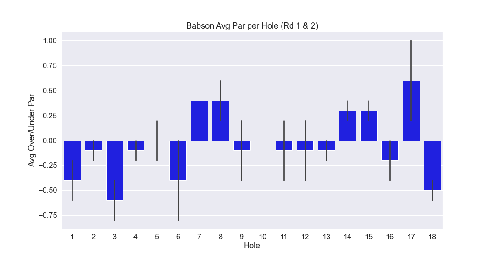
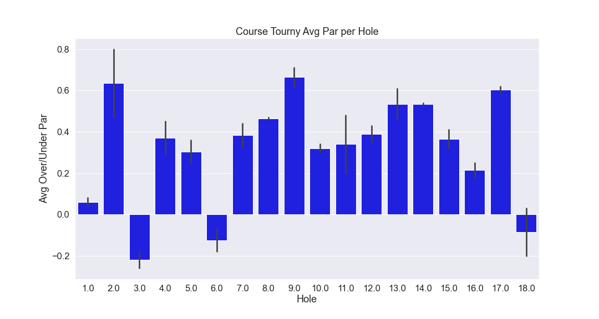
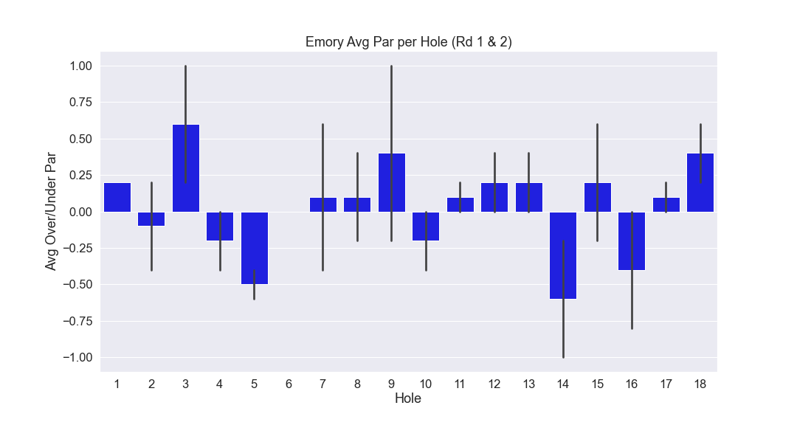
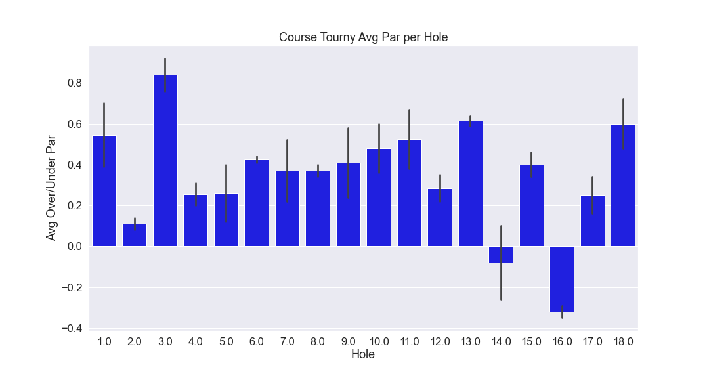

# BSC Golf Analysis

# Overview

In this project, we take a look at past golf tournaments and gather data in order to help the current golf team understand the course better. By looking at the winning team stats and the tournament as a whole, we were able to gather data on each par per hole. 

This information was found on the golfstats website. In order to get the data in a usable format, we had to webscrape the data off the website. Once the webscraping was done, we had to manipulate it to form a usable csv file to be able to create charts to illustrate our findings.

# Royal Lakes Tournament 2021
Winning team average par per hole.

Tournament as a whole average par per hole

# Stone Bridge Tournament 
Winning team average par per hole.

Tournament as a whole average par per hole

